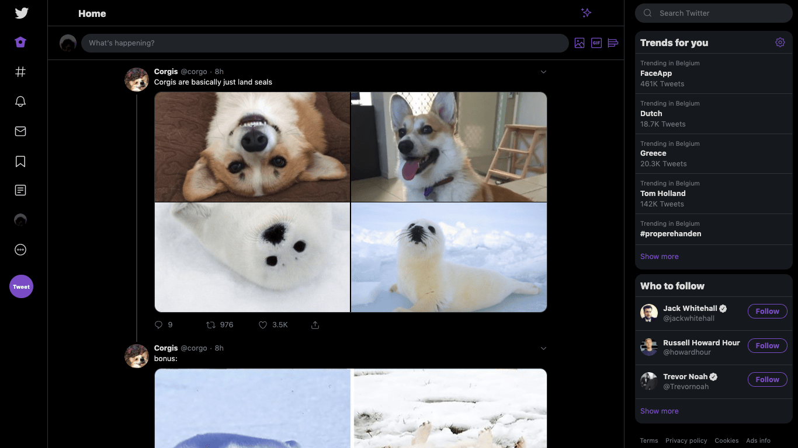
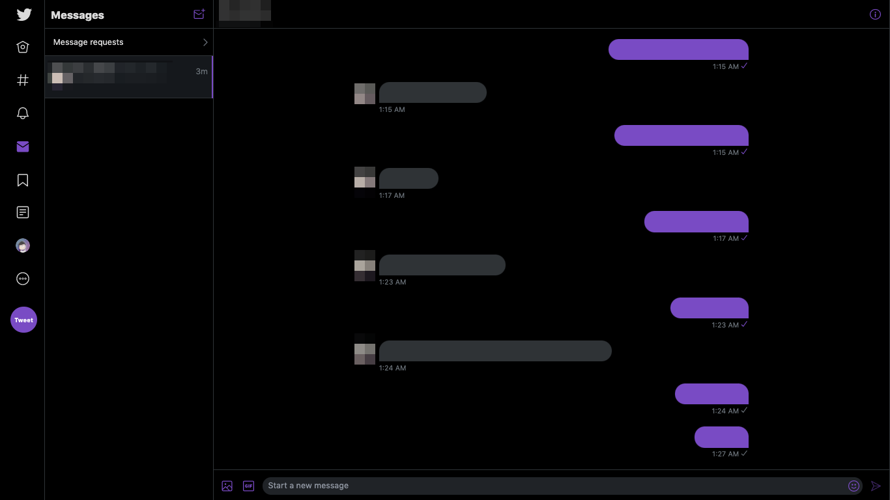

# Better Twitter redesign

_A Userstyle for Twitter to make the Twitter redesign more bearable_

|          Home           |          Chat           |
| :---------------------: | :---------------------: |
|  |  |

# [📦 UserCSS file ](https://raw.githubusercontent.com/duncannah/better-twitter-redesign/master/dist/better-twitter-redesign.user.css)

## Installation

A userstyle extension is required, I recommend using **_Stylus for [Chrome](https://chrome.google.com/webstore/detail/stylus/clngdbkpkpeebahjckkjfobafhncgmne) or [Firefox](https://addons.mozilla.org/en-US/firefox/addon/styl-us/)_**.

Then, click on the "📦 UserCSS file" link on the top, then click "Install style" on the left. I highly recommend enabling checking for updates.

Refresh any Twitter tabs or restart your browser if needed.

**To know more about UserCSS, please take a look at: [General information about UserCSS](https://github.com/openstyles/stylus/wiki/Usercss).**

This Userstyle is also available on userstyles org [here](https://userstyles.org/styles/173595/better-twitter-redesign), but I highly recommend you to use the UserCSS version instead.

## Building

After installing dependencies using `yarn install`, simply run `yarn build`; the files will be on the `dist` folder.

## License

This software is licensed under AGPL 3.0; a copy can be found under [LICENSE](LICENSE).
